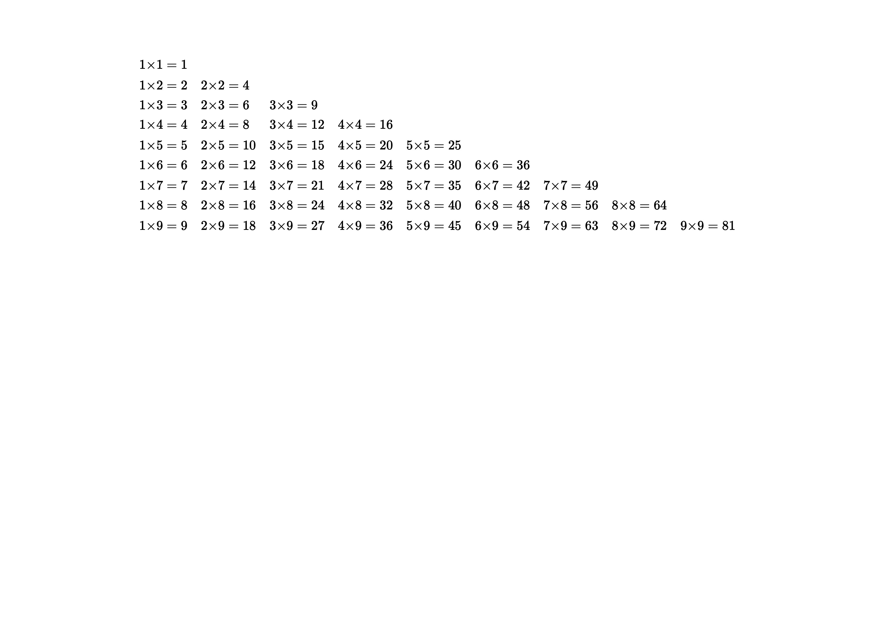

$$
\begin{align*}
    1{\times}1 & = 1 & \\
    1{\times}2 & = 2 &     2{\times}2 & = 4 & \\
    1{\times}3 & = 3 &     2{\times}3 & = 6 &     3{\times}3 & = 9 & \\
    1{\times}4 & = 4 &     2{\times}4 & = 8 &     3{\times}4 & = 12 &     4{\times}4 & = 16 & \\
    1{\times}5 & = 5 &     2{\times}5 & = 10 &     3{\times}5 & = 15 &     4{\times}5 & = 20 &     5{\times}5 & = 25 & \\
    1{\times}6 & = 6 &     2{\times}6 & = 12 &     3{\times}6 & = 18 &     4{\times}6 & = 24 &     5{\times}6 & = 30 &     6{\times}6 & = 36 & \\
    1{\times}7 & = 7 &     2{\times}7 & = 14 &     3{\times}7 & = 21 &     4{\times}7 & = 28 &     5{\times}7 & = 35 &     6{\times}7 & = 42 &     7{\times}7 & = 49 & \\
    1{\times}8 & = 8 &     2{\times}8 & = 16 &     3{\times}8 & = 24 &     4{\times}8 & = 32 &     5{\times}8 & = 40 &     6{\times}8 & = 48 &     7{\times}8 & = 56 &     8{\times}8 & = 64 & \\
    1{\times}9 & = 9 &     2{\times}9 & = 18 &     3{\times}9 & = 27 &     4{\times}9 & = 36 &     5{\times}9 & = 45 &     6{\times}9 & = 54 &     7{\times}9 & = 63 &     8{\times}9 & = 72 &     9{\times}9 & = 81 & \\
\end{align*}
$$
